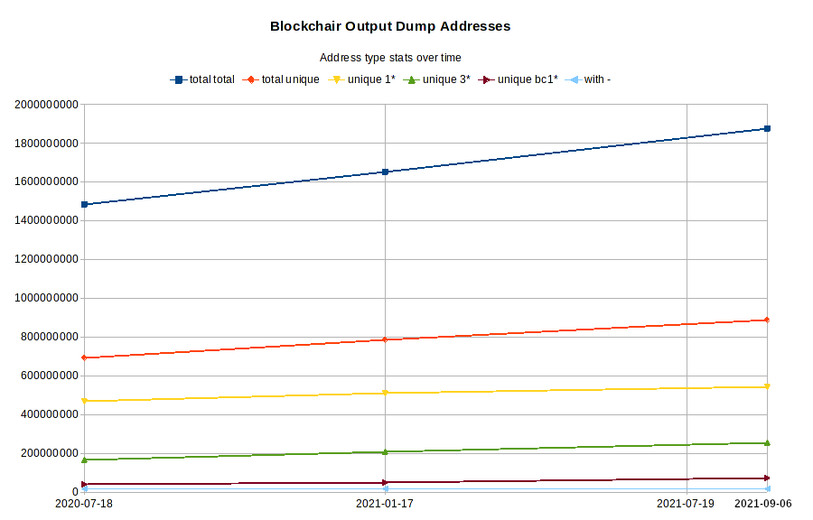
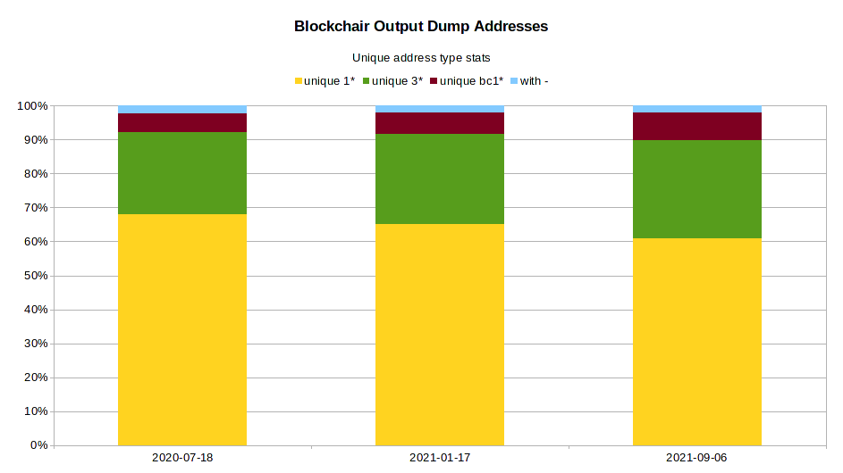

# bitcoin-all-addresses

## Lists of Unique Addresses from Blockchair Output Dumps

Address list is split in 339 files (xaa to xna)
totalling approximately 29.6G of plain text.

One feature of these lists is addresses are kept in the same order
they first appeared in Blockchair dumps.

## Statistics





### 2020-07-18

TYPE            | MATCHES
:---------------|---------------:
__addresses total__ |       1483853800
__unique addresses total__|  692773144
__unique addresses 1*__|     470763465
__unique addresses 3*__ |    167765027
__unique addresses bc1*__|    39094520
__unique addresses with -__|  15150132 

### 2021-01-17†

TYPE            | MATCHES
:---------------|---------------:
__addresses total__|        1652542603
__unique addresses total__|  784345877
__unique addresses 1*__|     510031682
__unique addresses 3*__ |    208054134
__unique addresses bc1*__|    50366868
__unique addresses with -__|  15893193

† Generated with a bad copy of
`blockchair_bitcoin_outputs_20201205.tsv.gz` (37351424 vs 66416920 bytes)
and lacked about half a single day worth of addresses.


### 2021-09-06

TYPE            | MATCHES
:---------------|---------------:
__addresses total__|        1878107037
__unique addresses total__|  889251545
__unique addresses 1*__|     542375558
__unique addresses 3*__ |    255864869
__unique addresses bc1*__|    74111219
__unique addresses with -__|  16899899

---

## Methodology

### 1. Download all output dump files from Blockchair

See script
[blockchair.btcoutputs.sh](https://github.com/mountaineerbr/bitcoin-all-addresses/blob/master/blockchair.btcoutputs.sh).

#### 1.1 Make sure files are processed in the correct date order in all steps required!

#### 1.2. Check the smallest file sizes to be sure those files downloaded correctly

#### 1.3. Also test .tsv.gz files

```bash
gunzip -t *.tsv.gz
```

### 2. Uncompress files, cut the 7th field (recipient) and number lines

```bash
gunzip -vc *.tsv.gz | cut -f7 | nl > file_step2.txt
```

### 3. Sort and output unique addresses only and resort in the original order

Tip: set large temporary directory for buffers and LC_ALL and LANG to C
(GNU tools will work faster) and also consider setting `sort` option `--parallel=N`:

```bash
export TMPDIR=/some/large/tmpdir
export LC_ALL=C LANG=C

sort -k2 -u file_step2.txt | sort -n concatnl.uniq.txt | cut -f2 > final.txt
```

### 4. Split resulting file at about 94MB to upload to github

```bash
split -C 94000000 final.txt
```

### 5. Pipeline

These commands may be piped together. Check script
[blockchair.btcoutputs.process.sh](https://github.com/mountaineerbr/bitcoin-all-addresses/blob/master/blockchair.btcoutputs.process.sh)
for more code tips.

---

	Please consider sending me a nickle!  =)
  
		bc1qlxm5dfjl58whg6tvtszg5pfna9mn2cr2nulnjr

---

## Notes

[Dump files from blockchair](https://gz.blockchair.com/bitcoin/outputs/).

[Checksum of dump files](https://github.com/mountaineerbr/bitcoin-all-addresses/blob/master/cksum.blockchair.outputs.txt).

Blockchair dumps contain a header and the 7th field is `recipient`.

Addresses starting with - in Blockchair dumps are unspendable and usually encode data.

This repo had to be re-uploaded to GitHub.

_Thank you, Blockchair team and loyceV!_

## See Also

loyceV address lists, which should be updated often (but his lists are not chronological):

List of all Bitcoin addresses ever used -- https://bitcointalk.org/index.php?topic=5265993.0

List of all Bitcoin addresses with a balance -- https://bitcointalk.org/index.php?topic=5254914.0

## References

Original topic in Bitcointalk that led to this repo -- https://bitcointalk.org/index.php?topic=5259621.0

https://blog.chainalysis.com/reports/bitcoin-addresses

https://blockchair.com/dumps/

https://gz.blockchair.com/bitcoin/

http://addresses.loyce.club/?C=M;O=D

http://loyceipv6.tk:20319/blockdata

## Blockchair Output Dump Example

    block_id	transaction_hash	index	time	value	value_usd	recipient	type	script_hex	is_from_coinbase	is_spendable
    627216	c3f6f9f111d82f0d85a21ae33f2c04a246fd6aa746356dc162b050b1580087d4	0	2020-04-23 00:01:33	1275221726	90619.5547	3DPNFXGoe8QGiEXEApQ3QtHb8wM15VCQU3	scripthash	a914804afd8b3479267b0cd0bb2fa2e217096005fb8d87	1	-1
    627216	c3f6f9f111d82f0d85a21ae33f2c04a246fd6aa746356dc162b050b1580087d4	1	2020-04-23 00:01:33	0	0	d-ca0f11f4d1ed11d2a21631c997297ad3	nulldata	6a24aa21a9edbbc38058972c3ce1b8a62707a2f7bb7435470a21bdb79e17d0fd5750f1c2d710	1	0
    627216	c3f6f9f111d82f0d85a21ae33f2c04a246fd6aa746356dc162b050b1580087d4	2	2020-04-23 00:01:33	0	0	d-75f76e58604a3bcec5d894cfde8f49bb	nulldata	6a24b9e11b6d6cf77e3a8f132aa378916c61d695d5c9529ecbe17533813afdae84e58e2af9ba	1	0
    627216	905e3559500ead03b3748673f72458e93a850c52f91cfa4b28939d7dab62adf6	0	2020-04-23 00:01:33	36218850	2573.7769	37b3ZQ3qq3WW8b1AqvtxHozeJGb2NheP4c	scripthash	a91440af9fc5e268776c1be03625786e409429a9c99587	0	-1
    627216	f14d45cdd1cd01468e39a3f4eb0f0385429277e6fd5b3ae1daf57a0b95ae01b8	0	2020-04-23 00:01:33	78848	5.6031	33hzuuQUMLceqF7tdGV25nF2q1TXuZvNb2	scripthash	a914161fd2d5674a6ee26460a6fc13b00050d194950487	0	-1
    627216	f14d45cdd1cd01468e39a3f4eb0f0385429277e6fd5b3ae1daf57a0b95ae01b8	1	2020-04-23 00:01:33	417315	29.6552	3Nrk1jRFigsKBVepPfPfpUvWXcfYWoQqYj	scripthash	a914e83185060a0feecdb5eb053e1a9a516f8ae0a5c887	0	-1
    627216	f14d45cdd1cd01468e39a3f4eb0f0385429277e6fd5b3ae1daf57a0b95ae01b8	2	2020-04-23 00:01:33	464347	32.9973	36H5Cyx5N5UjxhvrQfPdypH1PVed9ySQbi	scripthash	a914325162ff20edc6bfe8e9da62f851cb83699bd54487	0	-1
    627216	f14d45cdd1cd01468e39a3f4eb0f0385429277e6fd5b3ae1daf57a0b95ae01b8	3	2020-04-23 00:01:33	666366	47.3532	1A5fd5NXr2Y6eMp2bTqXaqgmFuv3UqWg4d	pubkeyhash	76a914639b0931a98fa1ff3257e9be0aebb31a53c863c888ac	0	-1
    627216	f14d45cdd1cd01468e39a3f4eb0f0385429277e6fd5b3ae1daf57a0b95ae01b8	4	2020-04-23 00:01:33	975276	69.3049	3Lhov12hd3J7JNdh8wWVKWgZKpFfbN5Rby	scripthash	a914d090c7ec69f36e1e52561dfb22d32464368a6d8087	0	-1

